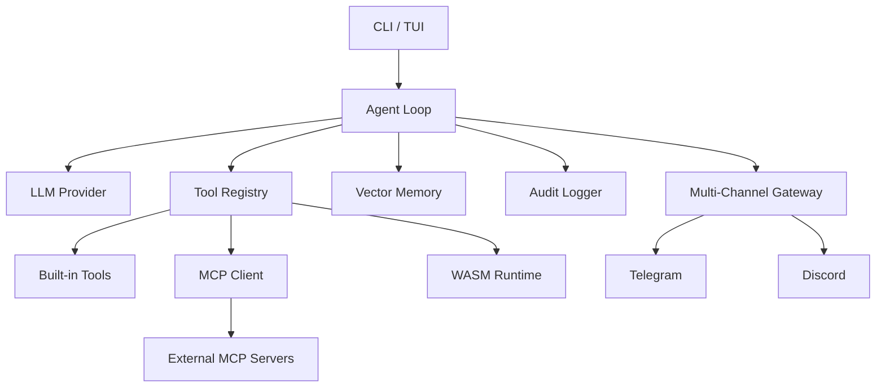

<p align="center">
  
</p>

<h1 align="center">QuectoClaw</h1>

<p align="center">
  <strong>Ultra-efficient AI Coding Assistant — Built in Rust 🦀</strong>
</p>

<p align="center">
  <a href="#features"></a>
  <a href="#installation"></a>
  <a href="#mcp-support"></a>
  <a href="#wasm-plugins"></a>
  <a href="LICENSE"></a>
</p>

<p align="center">
  <a href="#installation">Installation</a> •
  <a href="#quick-start">Quick Start</a> •
  <a href="#features">Features</a> •
  <a href="#configuration">Configuration</a> •
  <a href="#roadmap">Roadmap</a>
</p>

---

## 🚀 Overview

**QuectoClaw** is a high-performance, self-contained AI agentic coding assistant designed for speed and flexibility. Unlike heavy Python/Node.js alternatives, QuectoClaw compiles to a single **<5MB binary** with **zero runtime dependencies**.

It connects to any **OpenAI-compatible LLM** (OpenAI, Anthropic, Ollama, Groq) and orchestrates a powerful loop of tools, sub-agents, and plugins to solve complex tasks—from coding and debugging to research and system automation.

### Why QuectoClaw?

- **⚡ Blazing Fast**: Rust-based architecture with async I/O and minimal memory footprint.
- **🔌 Universal Connectivity**: First-class support for **Model Context Protocol (MCP)** and OpenAI API standards.
- **🛡️ Secure & Auditable**: Built-in tamper-proof **Audit Logging** and sandboxed execution.
- **🧩 Extensible**: Drop-in **WASM** and JSON plugins, plus a YAML-based workflow engine.
- **🖥️ Multi-Interface**: Interactive **CLI**, **TUI Dashboard**, **Web UI**, and **Telegram/Discord** Gateway.

---

## 📦 Installation

### From Source

Ensure you have Rust installed (`cargo`).

```bash
# Clone the repository
git clone https://github.com/your-username/QuectoClaw.git
cd QuectoClaw

# Build optimized release binary
cargo build --release
```

The binary will be available at `target/release/quectoclaw`.

### Feature Flags

Enable additional capabilities during build:

```bash
# Enable WASM Plugin Runtime
cargo build --release --features wasm

# Enable Telegram & Discord Gateway
cargo build --release --features "telegram,discord"

# Enable All Features
cargo build --release --all-features
```

---

## ⚡ Quick Start

### 1. Initialize

Run the onboarding wizard to set up your configuration and workspace:

```bash
quectoclaw onboard
```
*Creates `~/.quectoclaw/config.json` and workspace templates.*

### 2. Configure

Edit `~/.quectoclaw/config.json` to add your LLM API key:

```json
"providers": {
  "openai": {
    "api_key": "sk-your-key-here",
    "api_base": "https://api.openai.com/v1"
  }
}
```

### 3. Run

**Interactive Agent Mode:**
```bash
quectoclaw
```

**One-Shot Command:**
```bash
quectoclaw agent -m "Analyze the src/ dir and explain the architecture"
```

**Workflow Automation:**
```bash
quectoclaw run ./workflows/audit-codebase.yaml
```

---

## ✨ Features

### 🛠️ Powerful Tool Suite
QuectoClaw comes with a robust set of built-in tools:
| Category | Tools | Description |
|----------|-------|-------------|
| **System** | `exec`, `list_dir` | Safe shell execution and recursive directory listing. |
| **Filesystem** | `read_file`, `write_file`, `edit_file`, `append_file` | Full file manipulation with surgical editing capabilities. |
| **Web** | `web_search`, `web_fetch` | Live internet access via search APIs and content fetching. |
| **Memory** | `vectordb_index`, `vectordb_search` | RAG-powered long-term memory for semantic context. |
| **Meta** | `subagent` | Spawns hierarchical sub-agents for complex task delegation. |

### 🔌 MCP Support (Model Context Protocol)
Connect standard MCP servers to extend QuectoClaw's capabilities instantly.

*Config example:*
```json
"mcp": {
  "servers": {
    "sqlite": {
      "command": "uvx",
      "args": ["mcp-server-sqlite", "--db-path", "test.db"]
    }
  }
}
```

### 🧩 WASM & JSON Plugins
Extend the agent without recompiling.
- **WASM Plugins**: Python/JS/Rust code compiled to WASM for sandboxed execution (`workspace/wasm_plugins`).
- **JSON Plugins**: Simple command wrappers (`workspace/plugins`).

### 📊 TUI Dashboard & Web UI
Monitor your agent in real-time.

**Terminal Dashboard:**
```bash
quectoclaw dashboard
```

**Web Interface:**
```bash
quectoclaw webui --port 3000
```

### 📜 Robust Audit Logging
Enterprise-grade audit trails for every action.
```bash
# View recent logs
quectoclaw audit --limit 50

# Follow live logs
quectoclaw audit --follow
```

---

## 🏗️ Architecture

QuectoClaw is built on a modular, event-driven architecture:



See [plan.md](plan.md) for a detailed deep-dive.

---

## 🗺️ Roadmap

| Phase | Feature | Status |
|-------|---------|--------|
| **1-6** | Core Agent, Streaming, TUI, Split-Brain | ✅ Complete |
| **7** | **MCP Support**, Vector DB, Web UI | ✅ Complete |
| **8** | **Audit Logging**, Workflow Engine | ✅ Complete |
| **9** | **WASM Runtime**, Plugin Marketplace | ✅ Complete |
| **10** | Cross-platform Binaries, Docker, Homebrew | 🚧 In Progress |

---

## 🤝 Contributing

We welcome contributions! Please follow these steps:
1. Fork the repo.
2. Create a feature branch (`git checkout -b feature/amazing-feature`).
3. Commit your changes (Standard Conventional Commits).
4. Push to the branch.
5. Open a Pull Request.

**Development Commands:**
```bash
cargo test          # Run all tests
cargo clippy        # Lint code
cargo fmt           # Format code
```

---

## 📄 License

Distributed under the Apache 2.0 License. See `LICENSE` for more information.

---

<p align="center">
  <sub>Built with ❤️ by the QuectoClaw Team.</sub>
</p>
