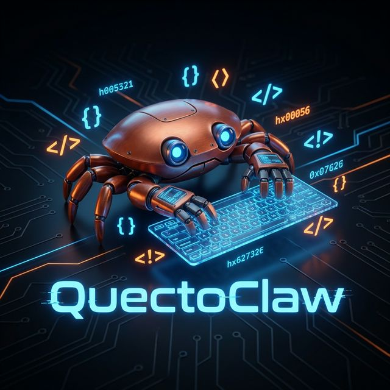
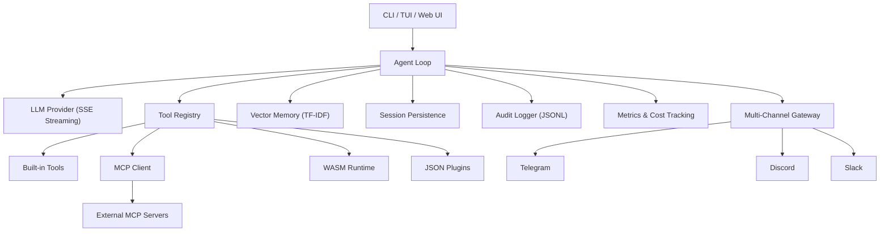

<p align="center">
  
</p>

<h1 align="center">QuectoClaw</h1>

<p align="center">
  <strong>Ultra-efficient AI Coding Assistant — Built in Rust 🦀</strong><br>
  <sub>(We call it <b>QuectoClaw</b>)</sub>
</p>

<p align="center">
  <a href="https://github.com/QuectoClaw/QuectoClaw/actions"></a>
  <a href="https://github.com/QuectoClaw/QuectoClaw/releases"></a>
  <a href="#-built-in-tool-suite"></a>
  <a href="#-installation"></a>
  <a href="#-model-context-protocol-mcp"></a>
  <a href="#-wasm--json-plugins"></a>
  <a href="LICENSE"></a>
</p>

<p align="center">
  <a href="#-installation">Installation</a> •
  <a href="#-quick-start">Quick Start</a> •
  <a href="#-features">Features</a> •
  <a href="#%EF%B8%8F-configuration">Configuration</a> •
  <a href="#-architecture">Architecture</a> •
  <a href="#-security">Security</a> •
  <a href="#-contributing">Contributing</a>
</p>

---

## Overview

**QuectoClaw** is a high-performance, self-contained AI agentic coding assistant designed for speed and flexibility. Unlike heavyweight Python/Node.js alternatives, QuectoClaw compiles to a single **<5 MB binary** with **zero runtime dependencies**.

It connects to any **OpenAI-compatible LLM** (OpenAI, Anthropic, Ollama, Groq, and more) and orchestrates a powerful loop of tools, sub-agents, and plugins to solve complex tasks — from coding and debugging to research and system automation.

### Why QuectoClaw?

| | |
|---|---|
| **Blazing Fast** | Rust-based architecture with fully async I/O and minimal memory footprint. |
| **Universal LLM Connectivity** | First-class support for **Model Context Protocol (MCP)** and any OpenAI-compatible API. Multi-model routing lets you assign different tasks to different models. |
| **Secure & Auditable** | Tamper-proof **audit logging**, command allowlists, SSRF protection, workspace scoping, secret redaction, and sandboxed plugin execution. |
| **Extensible** | Drop-in **WASM** and **JSON** plugins, a YAML-based workflow engine, and a built-in plugin marketplace. |
| **Multi-Interface** | Interactive **CLI**, **TUI Dashboard**, **Web UI** (Axum + HTMX), and **Telegram / Discord** gateways. |
| **RAG-Powered Memory** | Built-in TF-IDF vector database for long-term semantic context retrieval. |

---

## 📦 Installation

### From Source (Recommended)

Requires [Rust](https://rustup.rs/) 1.70+.

```bash
git clone https://github.com/QuectoClaw/QuectoClaw.git
cd QuectoClaw
cargo build --release
```

The optimized binary will be at `target/release/quectoclaw` (typically <5 MB).

### Homebrew (macOS / Linux)

```bash
brew install QuectoClaw/tap/quectoclaw
```

### Docker

```bash
docker pull ghcr.io/quectoclaw/quectoclaw:latest

# Or build locally
docker compose up -d
```

See the [Dockerfile](Dockerfile) and [docker-compose.yml](docker-compose.yml) for details.

### Pre-built Binaries

Download binaries for **Linux (x86_64)**, **macOS (Intel & Apple Silicon)**, and **Windows** from the [Releases](https://github.com/QuectoClaw/QuectoClaw/releases) page.

### Feature Flags

Enable additional capabilities at build time:

```bash
# WASM Plugin Runtime
cargo build --release --features wasm

# Telegram Gateway
cargo build --release --features telegram

# Discord Gateway
cargo build --release --features discord

# Everything
cargo build --release --all-features
```

| Feature    | Description                       | Default |
|------------|-----------------------------------|---------|
| `wasm`     | WASM plugin runtime (Wasmtime)    | Off     |
| `telegram` | Telegram bot adapter (teloxide)   | Off     |
| `discord`  | Discord bot adapter (serenity)    | Off     |

---

## ⚡ Quick Start

### 1. Initialize

Run the onboarding wizard to generate your configuration and workspace:

```bash
quectoclaw onboard
```

This creates `~/.quectoclaw/config.json` with sensible defaults and workspace templates.

### 2. Configure

Add your LLM provider API key:

```bash
# Via environment variable (recommended)
export QUECTO_PROVIDER_API_KEY="sk-your-key-here"

# Or edit the config file directly
nano ~/.quectoclaw/config.json
```

```jsonc
// ~/.quectoclaw/config.json (excerpt)
{
  "provider": {
    "name": "openai",
    "api_key": "sk-your-key-here",
    "base_url": "https://api.openai.com/v1",
    "default_model": "gpt-4o"
  }
}
```

### 3. Run

**Interactive agent mode** (default):
```bash
quectoclaw
```

**One-shot command**:
```bash
quectoclaw agent -m "Analyze the src/ directory and explain the architecture"
```

**Workflow automation**:
```bash
quectoclaw run ./workflows/audit-codebase.yaml --args input=src/
```

---

## ✨ Features

### 🛠️ Built-in Tool Suite

| Category       | Tools                                        | Description                                                    |
|----------------|----------------------------------------------|----------------------------------------------------------------|
| **System**     | `exec`, `list_dir`                           | Safe shell execution with command allowlists and recursive directory listing. |
| **Filesystem** | `read_file`, `write_file`, `edit_file`, `append_file` | Full file manipulation with surgical find-and-replace editing.  |
| **Web**        | `web_search`, `web_fetch`                    | Live internet access via search APIs and content fetching with SSRF protection. |
| **Memory**     | `vectordb_index`, `vectordb_search`          | RAG-powered long-term memory using TF-IDF semantic search.     |
| **Meta**       | `subagent`                                   | Spawns hierarchical sub-agents for complex task delegation (max depth: 3). |

### 🔌 Model Context Protocol (MCP)

Connect any standard MCP server to extend QuectoClaw's capabilities without writing code:

```jsonc
// ~/.quectoclaw/config.json
"mcp": {
  "servers": {
    "sqlite": {
      "command": "uvx",
      "args": ["mcp-server-sqlite", "--db-path", "test.db"]
    },
    "github": {
      "command": "npx",
      "args": ["-y", "@modelcontextprotocol/server-github"]
    }
  }
}
```

MCP tools are automatically discovered and registered alongside built-in tools.

### 🧩 WASM & JSON Plugins

Extend the agent without recompiling:

- **WASM Plugins** — Compile Python, JavaScript, or Rust code to WebAssembly for sandboxed execution with fuel limits and no filesystem/network access. Place compiled `.wasm` files in `workspace/wasm_plugins/`.
- **JSON Plugins** — Simple shell command wrappers defined as JSON files. Drop them into `workspace/plugins/` with a name, description, command template, and parameters.

**JSON Plugin example:**
```json
{
  "name": "line_count",
  "description": "Count lines in a file",
  "command": "wc -l {{file}}",
  "parameters": {
    "file": { "type": "string", "description": "Path to the file" }
  },
  "timeout_secs": 10
}
```

### 🔀 Multi-Model Routing

Route different tasks to different models based on capability. Configure routing rules in your config to use fast models for simple tasks and powerful models for complex reasoning.

### 💰 Cost Tracking

Built-in per-model token cost estimation with configurable budget alerts. Monitor spending in real-time through the TUI dashboard or the `/metrics` slash command.

### 📊 TUI Dashboard & Web UI

Monitor your agent sessions, tool usage, token consumption, and performance in real-time.

**Terminal dashboard** (Ratatui):
```bash
quectoclaw dashboard
```

**Web interface** (Axum + HTMX):
```bash
quectoclaw webui --port 3000
```

The web UI binds to `127.0.0.1` by default and requires bearer token authentication on API endpoints.

### 📜 Audit Logging

Enterprise-grade, tamper-proof, append-only JSONL audit trails for every agent action:

```bash
# View the 50 most recent entries
quectoclaw audit --limit 50

# Follow the audit log in real-time
quectoclaw audit --follow
```

### 🔄 Workflow Engine

Define multi-step automations in YAML with variable substitution:

```yaml
name: Code Audit
description: Analyze and report on code quality
steps:
  - name: Scan
    prompt: "List all files in {{ directory }} and identify potential issues"
  - name: Report
    prompt: "Summarize the findings into a markdown report"
```

```bash
quectoclaw run workflow.yaml --args directory=src/
```

### 🏪 Plugin Marketplace

Discover and install community-contributed plugins:

```bash
# Browse available plugins
quectoclaw plugin search

# Install a plugin
quectoclaw plugin install <plugin-name>

# List installed plugins
quectoclaw plugin list
```

### 📡 Multi-Channel Gateway

Deploy QuectoClaw as a service accessible via Telegram, Discord, or Slack:

```bash
quectoclaw gateway
```

Channels implement a **deny-all default** — configure `allow_from` lists with explicit user IDs or `"*"` for open access.

---

## 🖥️ CLI Reference

### Commands

| Command                  | Description                                      |
|--------------------------|--------------------------------------------------|
| `quectoclaw`             | Launch interactive agent mode (default)          |
| `quectoclaw agent -m "…"`| One-shot mode with a single message              |
| `quectoclaw agent -s key`| Resume a named session                           |
| `quectoclaw gateway`     | Start the multi-channel gateway service          |
| `quectoclaw dashboard`   | Open the TUI monitoring dashboard                |
| `quectoclaw webui`       | Launch the web-based dashboard                   |
| `quectoclaw run <file>`  | Execute a YAML workflow                          |
| `quectoclaw onboard`     | Initialize workspace and config                  |
| `quectoclaw audit`       | View and manage the audit log                    |
| `quectoclaw plugin`      | Discover, install, and list plugins              |
| `quectoclaw status`      | Show configuration summary                       |
| `quectoclaw version`     | Print version information                        |

### Interactive Slash Commands

Available during an interactive agent session:

| Command          | Description                                  |
|------------------|----------------------------------------------|
| `/fork [name]`   | Branch the current conversation into a new session |
| `/clear`         | Reset the session (auto-backup before clearing)    |
| `/metrics`       | Display a performance and cost report              |
| `/help`          | List all available commands                        |
| `exit` / `quit`  | Exit interactive mode                              |

---

## ⚙️ Configuration

QuectoClaw uses a single JSON configuration file at `~/.quectoclaw/config.json`. All settings can also be overridden via environment variables.

### Full Configuration Reference

```jsonc
{
  // LLM Provider
  "provider": {
    "name": "openai",                          // Provider identifier
    "api_key": "sk-…",                         // API key (or use QUECTO_PROVIDER_API_KEY)
    "base_url": "https://api.openai.com/v1",   // Any OpenAI-compatible endpoint
    "default_model": "gpt-4o"                  // Default model for agent tasks
  },

  // Agent Behavior
  "agents": {
    "defaults": {
      "model": "gpt-4o",
      "max_tokens": 4096,
      "temperature": 0.7,
      "max_tool_iterations": 25,               // Max tool-use loop iterations
      "restrict_to_workspace": true            // Sandbox filesystem access
    }
  },

  // Workspace
  "workspace": "~/.quectoclaw/workspace",

  // Multi-Channel Gateway
  "channels": {
    "telegram": { "enabled": false, "token": "", "allow_from": [] },
    "discord":  { "enabled": false, "token": "", "allow_from": [] },
    "slack":    { "enabled": false, "webhook_url": "" }
  },

  // Web Search
  "tools": {
    "web": {
      "search": { "api_key": "", "max_results": 5 }
    }
  },

  // MCP Servers
  "mcp": {
    "servers": {}
  }
}
```

### Environment Variables

| Variable                     | Description                              | Example                          |
|------------------------------|------------------------------------------|----------------------------------|
| `QUECTO_PROVIDER_API_KEY`    | LLM provider API key                    | `sk-…`                           |
| `QUECTO_PROVIDER_BASE_URL`   | LLM provider base URL                   | `https://api.openai.com/v1`     |
| `QUECTO_DEFAULT_MODEL`       | Default model override                   | `gpt-4o`                        |
| `QUECTO_WORKSPACE`           | Workspace directory path                 | `~/projects/my-workspace`       |
| `QUECTO_WEB_AUTH_TOKEN`      | Bearer token for the web dashboard API   | `my-secret-token`               |

---

## 🏗️ Architecture

QuectoClaw is built on a modular, event-driven architecture with clean separation of concerns:



### Module Map

```
src/
├── main.rs              CLI entry point and command routing
├── lib.rs               Public module declarations
├── agent/
│   ├── mod.rs           AgentLoop — core orchestrator
│   ├── context.rs       System prompt builder
│   ├── gateway.rs       Multi-channel gateway service
│   └── memory.rs        Conversation summarization
├── bus.rs               Async message bus (mpsc-based)
├── channel/
│   ├── mod.rs           Channel trait + deny-all default
│   ├── telegram.rs      Telegram adapter (teloxide)
│   ├── discord.rs       Discord adapter (serenity)
│   └── slack.rs         Slack adapter (webhook)
├── config/
│   └── mod.rs           Hierarchical JSON config + env overrides
├── provider/
│   ├── mod.rs           LLMProvider trait and types
│   ├── http.rs          OpenAI-compatible HTTP client + SSE streaming
│   ├── factory.rs       Provider factory
│   └── router.rs        Multi-model routing
├── tool/
│   ├── mod.rs           Tool trait and ToolRegistry
│   ├── exec.rs          Shell execution with allowlist + forbidden paths
│   ├── filesystem.rs    Read, write, edit, list, append with path validation
│   ├── web.rs           Web search + fetch with SSRF protection
│   ├── subagent.rs      Hierarchical sub-agents (depth limit: 3)
│   ├── plugin.rs        Dynamic JSON plugin loader
│   ├── wasm_plugin.rs   Sandboxed WASM plugin runtime
│   ├── vectordb_index.rs  Vector indexing tool
│   └── vectordb_search.rs Vector search tool
├── vectordb/
│   └── mod.rs           Lightweight TF-IDF vector store
├── workflow/
│   ├── mod.rs           Workflow engine core
│   └── parser.rs        YAML workflow parser
├── session.rs           File-based JSON session persistence
├── audit.rs             Tamper-proof JSONL audit logging
├── market.rs            Plugin marketplace registry
├── metrics.rs           In-process observability + cost tracking
├── logger.rs            Structured tracing setup
├── tui/
│   ├── mod.rs           TUI module root
│   ├── app.rs           Shared state, events, log buffer
│   └── ui.rs            Ratatui layout and rendering
└── web/
    ├── mod.rs           Web UI server (Axum)
    ├── handlers.rs      API + HTMX fragment handlers
    └── templates.rs     HTML templates with SRI
```

For a deeper architectural walkthrough, see [plan.md](plan.md).

---

## 🔒 Security

QuectoClaw enforces security at multiple layers:

| Layer                  | Mechanism                                                                 |
|------------------------|---------------------------------------------------------------------------|
| **Language Safety**    | Zero `unsafe` code — entire codebase is safe Rust.                        |
| **TLS**               | `rustls-tls` — no OpenSSL dependency; TLS 1.2+ with certificate validation. |
| **Workspace Scoping**  | `restrict_to_workspace: true` by default — filesystem ops cannot escape the workspace. |
| **Command Allowlist**  | Configurable `allowed_commands` list with deny-list as secondary defense. |
| **Forbidden Paths**    | Blocks access to `/etc`, `/root`, `/proc`, `/sys`, `~/.ssh`, `~/.gnupg`, `~/.aws`. |
| **Null Byte Detection**| All path and command inputs reject null bytes.                            |
| **SSRF Protection**    | `web_fetch` blocks private IPs, localhost, and cloud metadata endpoints.  |
| **Web Dashboard**      | Binds to `127.0.0.1` by default; bearer token auth on API endpoints; XSS-escaped output. |
| **Channel Deny-All**   | Empty `allow_from` blocks all messages — require explicit IDs or `"*"`.   |
| **Plugin Shell Escaping** | `{{param}}` substitutions are single-quote escaped before interpolation. |
| **Subagent Depth Limit** | Max recursion depth of 3 to prevent resource exhaustion.                |
| **WASM Sandboxing**    | Plugins run with fuel limits, no filesystem or network access.            |
| **Secret Redaction**   | API keys are `#[serde(skip_serializing)]` and masked in `Debug` output.   |
| **Audit Logging**      | Structured, append-only JSONL audit trail.                                |
| **Supply Chain**       | `cargo-deny` in CI for advisories, license compliance, and source integrity. |
| **Release Hardening**  | `panic = "abort"`, LTO, symbol stripping in release builds.              |
| **CDN Integrity**      | SRI hashes on all external script tags (HTMX).                            |

For vulnerability reporting, see [SECURITY.md](SECURITY.md).

---

## 🧪 Testing

```bash
# Run the full test suite
cargo test

# Run tests with output
cargo test -- --nocapture

# Run a specific test module
cargo test config::
cargo test audit::
```

The test suite includes **80+ tests** covering:

- **Config** — loading, defaults, environment variable expansion
- **Provider** — response parsing, tool call parsing, streaming
- **Session** — add/get messages, clearing, persistence
- **Tools** — exec guards, path validation, filesystem restrictions
- **Metrics** — recording accuracy, report formatting, cost tracking
- **Audit** — event types, append-only integrity, directory creation
- **Workflow** — YAML parsing, variable substitution, edge cases
- **Marketplace** — listing, serialization, registry deserialization
- **Memory** — append/read, directory creation, timestamps
- **Plugin** — config parsing, loading, registration, shell escaping
- **Channel** — allow-from logic, deny-all default enforcement
- **VectorDB** — TF-IDF indexing and search accuracy
- **Router** — multi-model routing logic
- **Integration** — end-to-end agent loop with mock LLM, MCP client tests

---

## 🐳 Docker

### Quick Start with Docker Compose

```bash
cp .env.example .env    # Fill in your API keys
docker compose up -d
```

The web dashboard is available at `http://localhost:3000`.

### Build Manually

```bash
docker build -t quectoclaw .
docker run -it --rm \
  -e QUECTO_PROVIDER_API_KEY=sk-your-key \
  -v quecto-data:/home/quecto/.quectoclaw \
  -p 127.0.0.1:3000:3000 \
  quectoclaw
```

The Docker image uses a multi-stage build, runs as a non-root user (`quecto`), and produces a minimal Debian-based runtime image.

---

## ⚙️ Build Profiles

The release profile is tuned for minimal binary size:

```toml
[profile.release]
opt-level = "z"      # Optimize for size
lto = true           # Link-time optimization
codegen-units = 1    # Single codegen unit for better optimization
strip = true         # Strip debug symbols
panic = "abort"      # Abort on panic (no unwinding overhead)
```

---

## 🗺️ Roadmap

| Phase    | Feature                                          | Status         |
|----------|--------------------------------------------------|----------------|
| **1–6**  | Core Agent, SSE Streaming, TUI, Session Forking  | ✅ Complete     |
| **7**    | Integration Tests, Error Resilience, Rate Limiting, Config Validation | ✅ Complete |
| **8**    | Vector DB, MCP Support, Web UI, Multi-Model Routing, Cost Tracking | ✅ Complete |
| **9**    | Plugin Marketplace, Workflow Engine, Agent Memory, Audit Logging, WASM Plugins | ✅ Complete |
| **10**   | Security Hardening (Shell Injection, SSRF, XSS, Supply Chain, CI) | ✅ Complete |
| **11**   | Cross-platform Binaries, Docker, Homebrew, Crates.io | ✅ Complete |

---

## 🤝 Contributing

We welcome contributions of all kinds! Please follow these steps:

1. **Fork** the repository.
2. **Create** a feature branch: `git checkout -b feat/amazing-feature`.
3. **Develop** following the coding standards below.
4. **Commit** with [Conventional Commits](https://www.conventionalcommits.org/): `feat:`, `fix:`, `docs:`, `refactor:`.
5. **Push** to your branch and open a **Pull Request**.

### Development Commands

```bash
cargo fmt                      # Format all code
cargo clippy -- -D warnings    # Lint with zero-warnings policy
cargo test                     # Run the full test suite
cargo deny check               # Supply chain audit
```

### Code Quality Standards

- **Zero warnings** — `clippy -D warnings` must pass.
- **Format** — all code must be `cargo fmt` compliant.
- **Tests** — all existing tests must pass; new features should include tests.
- **Conventional Commits** — use `feat:`, `fix:`, `docs:`, `refactor:`, etc.
- **Safe Rust** — no `unsafe` code unless absolutely necessary and reviewed.

---

## 📄 License

Distributed under the **Apache License 2.0**. See [LICENSE](LICENSE) for details.

---

<p align="center">
  <sub>Built with ❤️ in Rust by the <a href="https://github.com/QuectoClaw/QuectoClaw">QuectoClaw</a> community.</sub>
</p>
